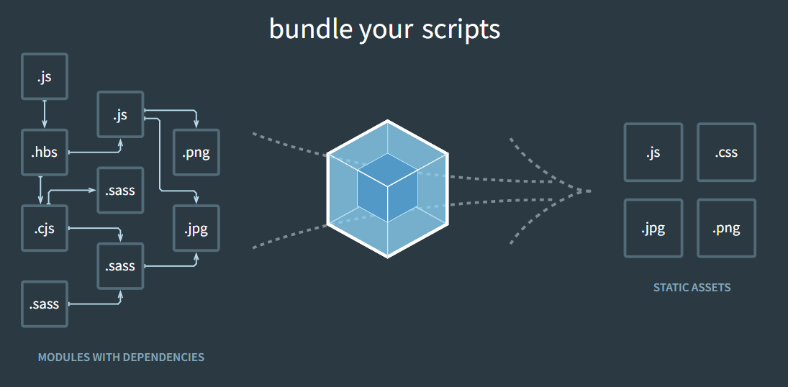

# Vite / Prettier

# Vite
$ npm create vite@latest
  yarn create vite
1. Bundling의 시작
   - node_modules 용량 큼
   - import require 문법은 브라우저 친화적이지 않음


2. Vite 시작
    - 프로젝트의 성장에 따라 번들링 시간이 늘어남
    - Webpack의 빌드 속도는 느림

3. 빠른 이유
   - esbuild 를 사용하여 종속성을 미리 Bundle

   - 브라우저가 요청할 때 소스 코드를 변환, 제공 조건부 동적으로 가져오기에 뒤에 있는 코드는 현재 화면에서 실제로 사용되는 경우에만 처리됩니다.


# Prettier
1. IntelliJ 설정
    - 언어 및 프레임워크 > JavaScript > Prettier
    - Prettier 패키지 : npm install -d prettier(해당 패키지)
    - 다음 파일에 대해 실행 : {**/*,*}.{js,ts,jsx,tsx,prettierrc,json,css,scss,sass}
    - 저장 시 활동 및 es-lint 같이 잡아주기
    - .prettierrc 파일 생성
```json
{
    "semi": true,
    "trailingComma": "all",
    "singleQuote": true,
    "printWidth": 100,
    "tabWidth": 4
}
```
